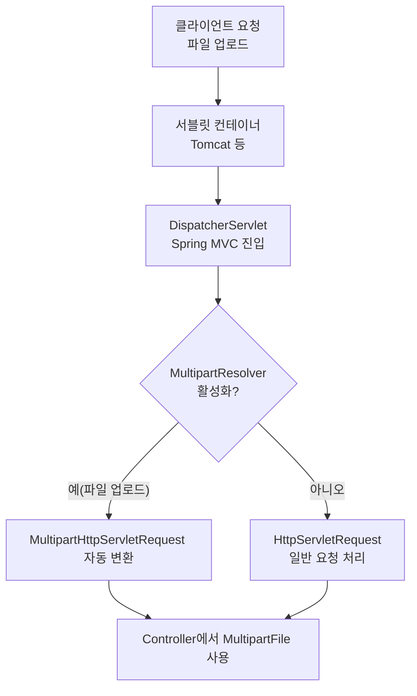

### 개념
- **Spring MVC에서 제공하는 HttpServletRequest 확장 인터페이스**
- 파일 업로드가 포함된 요청(`multipart/form-data`)을 처리하기 위해 사용

## 주요 특징
- `MultipartResolver`에 의해 일반 HttpServletRequest가 변환됨
- 파일을 쉽게 다룰 수 있는 API 제공
  - `getFile(String name)`
  - `getFiles(String name)`
  - `getFileMap()`


### 사용 예제
```java
@RequestMapping("/upload")
public String upload(MultipartHttpServletRequest request) throws Exception {
    MultipartFile file = request.getFile("file");
    String fileName = file.getOriginalFilename();
    file.transferTo(new File("/upload/" + fileName));
    return "success";
}

```

### 요청 처리 흐름




---

### 관련 정보

[[HttpServletRequest 서블릿 표준 API]]
[[서블릿 컨테이너 (Servlet Container)]]
[[Spring MVC]]