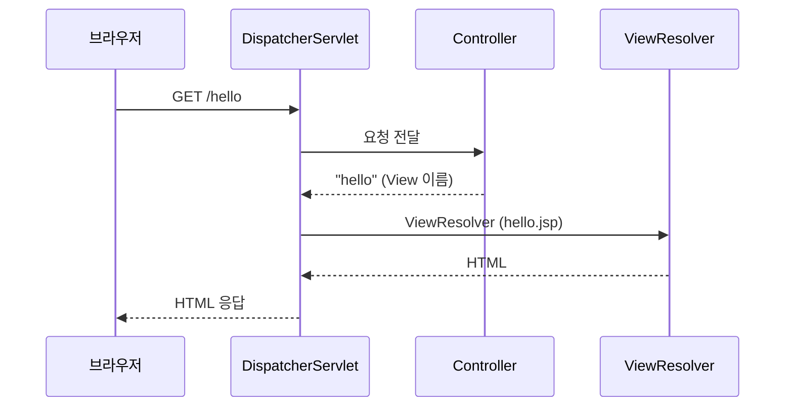
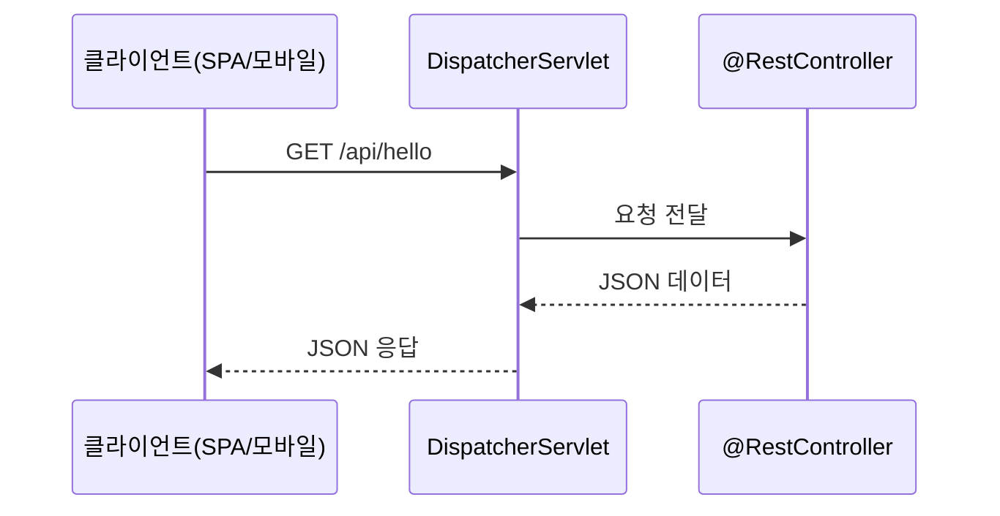

## 1. **전통적인 MVC 웹 앱 방식**

### 특징

- **View 중심**
    
- Controller가 **HTML/JSP 화면(View)** 을 반환
    
- 주로 **서버사이드 렌더링(SSR)** 에 사용
    
- 예:
    
    ```java
    @Controller
    public class HelloController {
        @GetMapping("/hello")
        public String hello(Model model) {
            model.addAttribute("msg", "Hello MVC!");
            return "hello"; // hello.jsp 렌더링
        }
    }
    ```
    
- 결과: HTML 문서
    

---

## 2. **REST API 방식 (Spring MVC + @RestController)**

### 특징

- **데이터 중심**
    
- Controller가 **JSON, XML 등 데이터**를 반환
    
- 뷰 없이 클라이언트(React, Vue, 모바일 앱 등)가 화면을 렌더링
    
- RESTful 서비스 구현 시 사용
    
- 예:
    
    ```java
    @RestController
    public class HelloApiController {
        @GetMapping("/api/hello")
        public Map<String, String> hello() {
            return Map.of("msg", "Hello API!");
        }
    }
    ```
    
- 결과: JSON
    

---

## 3. **핵심 차이**

|구분|전통 MVC (서버 렌더링)|REST API (데이터 제공)|
|---|---|---|
|Controller|`@Controller`|`@RestController`|
|반환값|View 이름 (JSP, Thymeleaf)|JSON/XML 데이터|
|사용 대상|브라우저 중심|SPA, 모바일, 외부 시스템|
|뷰 처리 주체|서버 (JSP/Thymeleaf)|클라이언트 (React, iOS 등)|

---

## 요청 흐름 비교

### 전통 MVC



### REST API



---

## 한 줄 정리

> **전통 MVC:** 화면(HTML)을 서버에서 만들어서 전달  
> **REST API:** 서버는 데이터(JSON 등)만 주고, 화면은 클라이언트가 만듦

---

### 연관 개념

- [[Spring MVC]]
    
- [[REST API 만들 때 사용하는 @RestController, @ResponseBody, ResponseEntity 설명]]
    