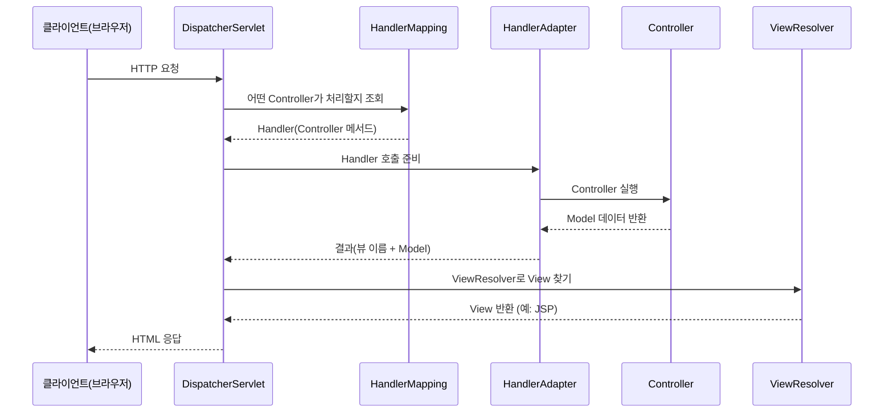
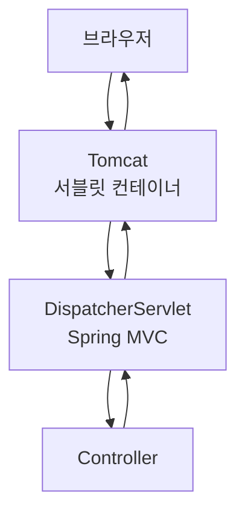

좋아요! **Spring MVC**는 스프링 프레임워크의 핵심 웹 모듈이라,  
Tomcat / HttpServletRequest / MultipartHttpServletRequest를 이해하면 자연스럽게 이어지는 개념이에요.  

---


### 개념

- **Spring Framework에서 제공하는 웹 애플리케이션 개발을 위한 MVC 패턴 기반 프레임워크**
    
- **MVC(Model-View-Controller)** 아키텍처를 구현하여 웹 요청을 깔끔하게 처리
    

---

### 핵심 흐름



---

### 주요 구성 요소

##### 1. DispatcherServlet

- **Front Controller 패턴**
    
- 모든 웹 요청의 진입점 (web.xml이나 Spring Boot 자동 설정으로 등록)
    
- 요청을 분석하고, 알맞은 Controller로 전달
    

##### 2. HandlerMapping

- URL과 컨트롤러 메서드의 매핑 정보를 관리
    

##### 3. Controller

- 비즈니스 로직을 수행하고 Model 데이터 반환
    

##### 4. ViewResolver

- Controller가 반환한 **뷰 이름(View Name)** 을 실제 뷰(JSP, Thymeleaf 등) 파일로 변환
    

##### 5. View

- HTML, JSON 등 최종 응답을 생성
    

---

### 동작 방식 (간단한 예)

```java
@Controller
public class HelloController {

    @GetMapping("/hello")
    public String hello(Model model) {
        model.addAttribute("msg", "Hello Spring MVC!");
        return "hello"; // View 이름 (hello.jsp)
    }
}
```

- `/hello` 요청 → DispatcherServlet → Controller → Model → ViewResolver → JSP 렌더링
    

---

### 장점

- **명확한 역할 분리 (MVC)**
    
- 스프링 DI, AOP와 자연스럽게 통합
    
- REST API, 파일 업로드, 국제화(i18n) 등 다양한 기능 지원
    
- Spring Boot와 결합하면 설정이 단순화
    

---

### 관계도 (Spring MVC와 컨테이너)



---

### 한 줄 요약

> **Spring MVC = Spring 기반 웹 개발을 위한 MVC 프레임워크**  
> **DispatcherServlet이 모든 요청을 받아 Controller에 전달하고 View를 반환한다.**

---

##### 연관 개념

- [[Spring MVC - 전통 MVC vs REST API]]

---

혹시 **Spring MVC와 Spring Boot의 관계**도 정리해 줄까요?  
아니면 **MVC와 REST API 처리 차이** 쪽이 궁금하세요?