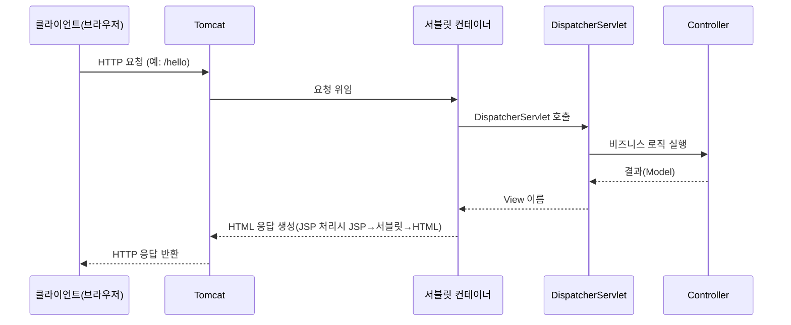

Tomcat은 **서블릿 컨테이너이자 경량 WAS**로, Spring MVC와 가장 많이 함께 사용되는 서버입니다.  

---

### 개념

- **Apache Tomcat** = 서블릿 컨테이너 + 간단한 WAS
    
- 서블릿/JSP 스펙을 구현한 오픈소스 서버
    
- Spring MVC 같은 자바 웹 애플리케이션을 실행할 때 가장 많이 사용
    

---

### 동작 구조

#### 1. **포트 기반 요청 처리**

- **기본 포트 8080**  
    (웹 서버처럼 HTTP 요청을 직접 받음)
    
- HTTPS 설정 시 8443 포트 사용
    

---

#### 2. **요청 흐름 (Servlet/JSP 처리)**

---

#### 3. **쓰레드 모델**

- **요청 1건 = 스레드 1개**
    
- Tomcat은 내부적으로 **스레드 풀(Executor)**을 관리
    
- 동시에 여러 요청을 처리할 수 있음
    

---

#### 4. **JSP 처리 과정**

JSP는 처음 요청될 때 **서블릿으로 변환**되고 이후에는 서블릿처럼 동작

1. JSP 파일 요청
    
2. Tomcat이 JSP → Java 서블릿 코드로 변환
    
3. 서블릿 코드 컴파일 → 클래스 파일 생성
    
4. 이후 요청부터는 이 서블릿 클래스를 재사용하여 빠르게 처리
    

---

### Tomcat의 역할

- **HTTP 요청/응답 처리** (웹 서버 역할)
    
- **서블릿/JSP 실행 환경 제공**
    
- **세션, 쿠키 관리**
    
- **스레드 풀 관리**
    

---

### Tomcat vs 풀 스펙 WAS

- Tomcat: 경량, 서블릿/JSP 중심
    
- 풀 스펙 WAS (WebLogic, WildFly 등): EJB, JMS, 분산 트랜잭션 등 엔터프라이즈 기능 포함
    

---

## 한 줄 요약

> Tomcat = **서블릿 컨테이너 + 간단한 웹 서버**  
> 스프링 MVC를 구동하는 가장 흔한 서버

---

### 관련 내용

- [[서블릿 컨테이너 (Servlet Container)]]
    
- [[WAS (Web Application Server)]]
    
- [[HttpServletRequest 서블릿 표준 API]]
    
- [[MultipartHttpServletRequest HttpServletRequest 확장 인터페이스 multipart form-data 처리]]
    
