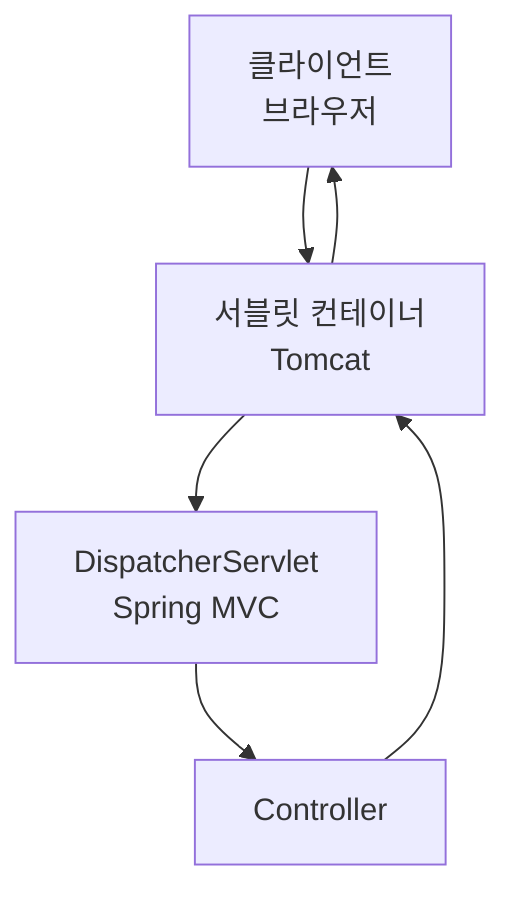

### 개념

- **웹 애플리케이션 서버(WAS) 안에서 서블릿을 실행·관리하는 엔진**
    
- 클라이언트(브라우저)로부터 들어온 HTTP 요청을 받아  
    **서블릿 객체를 실행시키고 응답을 돌려주는 역할**
    

---

### 역할

1. **HTTP 요청과 응답 처리**
    
    - 브라우저 → 컨테이너 → 서블릿 → 컨테이너 → 브라우저
        
2. **서블릿 생명주기 관리**
    
    - 서블릿 객체 생성, 초기화(init), 실행(service/doGet/doPost), 종료(destroy)
        
3. **멀티쓰레드 관리**
    
    - 요청마다 쓰레드 생성/재사용
        
4. **보안, 세션 관리**
    
    - HTTPS 처리, 세션 쿠키 관리
        

---

### 대표적인 서블릿 컨테이너

- **Tomcat** (가장 많이 사용)
    
- Jetty
    
- Undertow
    
- Resin
    

> Tomcat = **서블릿 컨테이너 + 간단한 웹 서버 기능**

---

### 요청 흐름에서의 위치

서블릿 컨테이너는 **브라우저와 Spring MVC 사이의 문지기** 같은 역할을 합니다.

---

### 정리

> **서블릿 컨테이너 = 서블릿 스펙에 맞춰 서블릿을 실행·관리하는 프로그램 (Tomcat이 대표적)**

---

### 관련 내용

[[WAS (Web Application Server)]]
[[WAS(Web Application Server)와 서블릿 컨테이너 차이점]]
[[Tomcat]]